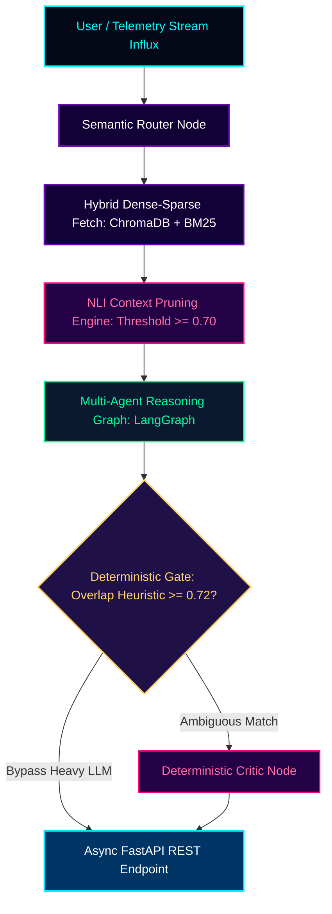

<!-- ======================================================================= -->
<!--                   SUPROVO // DYNO // NEURAL CORE v7.0                   -->
<!--        GOD-TIER CYBERPUNK HIGH-DENSITY AI SYSTEM ARCHITECT DOSSIER      -->
<!-- ======================================================================= -->

<div align="center">

<!-- Cyber Wave Dynamic Neon Header Banner -->


<!-- Holographic Neon Cyber Typing Terminal -->
<a href="https://git.io/typing-svg">
  
</a>

<br/>

<!-- Real-Time Status Badges & HUD Telemetry -->
<p align="center">
  <a href="#01--neural_dossier-identity_matrix"></a>
  <a href="#02--architectural_core-evidence_first_ai"></a>
  <a href="#04--open_source_ops-17_merged_prs"></a>
  <a href="#07--algorithmic_core-problem_solving"></a>
  
</p>

</div>

---

<!-- Animated Glowing Cyber Laser Divider -->
<div align="center">
  
</div>

<!-- ======================================================================= -->
<!--                              NEURAL DOSSIER                             -->
<!-- ======================================================================= -->

#  `01 // NEURAL_DOSSIER [IDENTITY_MATRIX]`

<table border="0" width="100%">
<tr>
<td width="58%" valign="top">

```yaml
# OPERATOR IDENTITY SPECIFICATION
OPERATOR:        Suprovo Mallick
CALLSIGN:        DYNO
ROLE:            Generative AI & ML Systems Engineer
ACADEMICS:       B.Tech in Computer Science @ KIIT (2023 - 2027)
ACCREDITATION:   BS in Data Science (Foundation) @ IIT Madras
COORDINATES:     West Bengal, India [88.3639° E, 22.5726° N]

# COMBAT MANIFESTO
DIRECTIVE: >
  "Notebook prototypes are child's play. I engineer verifiable,
  evidence-grounded, low-latency AI pipelines and multi-agent
  swarms architected to withstand heavy production concurrency."
```

#### ⚡ `TELEMETRY INTEGRITY GAUGES`
* **Adaptive RAG & Dynamic Pruning** `[████████████████] 100%` *(NLI Filtering)*
* **Multi-Agent State Orchestration** `[██████████████░░]  92%` *(LangGraph StateGraphs)*
* **Deterministic Output Grounding** `[██████████████░░]  90%` *(Token-Overlap Bypass)*
* **Inference Concurrency & APIs** `[███████████████░]  95%` *(FastAPI / 4-bit Quantization)*
* **Open Source Runtime Patches** `[████████████████]  98%` *(ComfyUI / LlamaIndex / Haystack)*

</td>
<td width="42%" align="center" valign="middle">

<!-- High-Tech Cyber HUD Loop -->


<br/><br/>

```ini
[RUNTIME_STATUS]
RETRIEVAL_LATENCY   = < 2.0s
HALLUCINATION_RATE  = < 10%
TOKEN_OPTIMIZATION  = ~80% PRUNED
CITATION_PRECISION  = 100% VERIFIED
```

</td>
</tr>
</table>

---

<!-- Animated Glowing Cyber Laser Divider -->
<div align="center">
  
</div>

<!-- ======================================================================= -->
<!--                        ARCHITECTURE & PHILOSOPHY                        -->
<!-- ======================================================================= -->

#  `02 // ARCHITECTURAL_CORE [EVIDENCE_FIRST_AI]`

> *"Foundation models are commoditized runtime engines. Real AI engineering begins at query semantics, dynamic pruning, context sanitation, and deterministic output verification."*

<div align="center">



</div>

<br/>

| LAYER | ENGINE SUBSYSTEM | ARCHITECTURAL IMPACT |
| :---: | :--- | :--- |
| **01** | **Hybrid Vector-Sparse Indexing** | Combined ChromaDB dense embeddings with BM25 sparse keyword rankers for multi-modal recall. |
| **02** | **Cross-Encoder NLI Pruning** | Strips duplicate and contradictory claims with NLI score $\ge 0.70$, slashing token spend by **$\sim 80\%$**. |
| **03** | **Stateful Multi-Agent Mesh** | LangGraph orchestration isolating Router, Extractor, Synthesizer, and Critic nodes with cyclic recovery. |
| **04** | **Deterministic Verification Gate** | Token-overlap heuristic ($\ge 0.72$) eliminates costly validation LLM calls; bounds hallucinations to **$< 10\%$**. |
| **05** | **Low-Latency Runtime Delivery** | Multi-worker async FastAPI backend with containerized Docker deployment delivering **$< 2.0\text{s}$** execution. |

---

<!-- Animated Glowing Cyber Laser Divider -->
<div align="center">
  
</div>

<!-- ======================================================================= -->
<!--                           FLAGSHIP SYSTEMS                              -->
<!-- ======================================================================= -->

#  `03 // FLAGSHIP_SYSTEMS [PRODUCTION_NODES]`

<!-- NODE 01 -->
<table width="100%">
<tr>
<td width="100%" bgcolor="#050816">

### 🧬 `NODE 01 // ADAPTIVE EVIDENCE RAG`
> **Intelligent, Self-Evaluating Context-Pruning Retrieval Engine**  
> `Latency: < 2.0s • Token Pruning: ~80% • Hallucination Rate: < 10% • EM Accuracy: > 75%`

```
[ARCHITECTURE FLOW]
Query ──► Dynamic Expansion ──► 5x Parallel Fetch ──► NLI Pruning (>=0.70) ──► Grounded Qwen-4bit
```

* **Hallucination Suppression ($< 10\%$):** Employs strict NLI contradiction filtering and atomic claim extraction prior to synthesis.
* **Context Sanitation:** Cross-encoder NLI independence metric eliminates $\sim 80\%$ of redundant tokens, ensuring ultra-dense context windows.
* **Full-Stack Container:** Containerized React.js + FastAPI pipeline powered by a local 4-bit quantized Qwen model for sub-2-second inference.

<div align="center">
  <a href="https://github.com/DYNOSuprovo/adaptive-evidence-rag"></a>
  <a href="https://huggingface.co/spaces/Dyno1307/adaptive-evidence-rag"></a>
</div>

</td>
</tr>
</table>

<br/>

<!-- NODE 02 -->
<table width="100%">
<tr>
<td width="100%" bgcolor="#050816">

### 🌌 `NODE 02 // PLUTO v2`
> **Multi-Agent Document Intelligence & Evidence Verification Mesh**  
> `Concurrency: 8-Worker Pool • Extraction Latency Drop: ~80% • Citation Precision: 100%`

```
[MULTI-AGENT PIPELINE]
Document ──► Router Node ──► Extractor + Retriever ──► Synthesizer ──► Critic Gate ──► Verified Payload
```

* **100% Verifiable Quote Attribution:** Router $\to$ Extractor $\to$ Synthesizer $\to$ Critic state graph guarantees unbacked claims are scrubbed.
* **80% Latency Drop:** Multi-worker thread pools combined with an internal two-tier LLM response cache eliminate redundant computation.
* **Heuristic Bypass Gate:** Token-overlap heuristic ($\ge 0.72$) bypasses heavy LLM critic verification for obvious evidence matches.

<div align="center">
  <a href="https://github.com/DYNOSuprovo/Pluto"></a>
  <a href="https://huggingface.co/spaces/ayushKishor/plutoV2_miniProject_3rd-yr"></a>
</div>

</td>
</tr>
</table>

<br/>

<!-- NODE 03 -->
<table width="100%">
<tr>
<td width="100%" bgcolor="#050816">

### 🧠 `NODE 03 // INTENT COMPILER`
> **Autonomous Architecture, Schema & Technical Specification Engine**  
> `Engine: LangGraph StateGraph • Inference: Groq LLaMA-3 LPU • Stack: Streamlit + Python`

```
[AUTONOMOUS COMPILATION]
Product Vision ──► Agent Graph ──► Requirements Spec + Architecture Blueprints + DB Schemas + Pseudocode
```

* Compiles natural-language product ideas into complete, production-grade technical blueprints, database schemas, and executable pseudocode.
* Employs stateful LangGraph agents that autonomously critique technical viability and validate dependency graphs before compilation.

<div align="center">
  <a href="https://github.com/DYNOSuprovo/intent-compiler"></a>
  <a href="https://intent-compiler-bydyno.streamlit.app/"></a>
</div>

</td>
</tr>
</table>

<br/>

<!-- AUXILIARY DEPLOYMENT MATRIX -->
<div align="center">

| SYSTEM NODE | CORE STACK & ARCHITECTURE | KEY PERFORMANCE METRIC | LIVE ENDPOINT |
| :--- | :--- | :--- | :---: |
| **🌾 WHEAT GUARDIAN** | Edge CV Crop Pathology (`EfficientNetV2B2 + OpenCV + FastAPI`) | **93%+ Accuracy • $\sim 300\text{ms}$ Latency** | [DEPLOYED APP](https://wheat-analysis-app.vercel.app) |
| **🌍 TRANSLATE-V2** | Low-Resource NMT Transformer (`PyTorch + NLLB-200 + FastAPI`) | **-38% Latency Gain via Batching** | [HF SPACE](https://huggingface.co/spaces/Dyno1307/Translate-V2) |
| **🥗 AAHAR** | Dietary RAG Assistant (`LangChain + Gemini + ChromaDB + React`) | **Personalized Multi-Turn Memory** | [WEB APP](https://aahar-react.vercel.app) |
| **💰 AI EXPENSE ADVISOR** | Financial Retrieval Engine (`Streamlit + LangChain + Gemini`) | **Semantic Spend Classification** | [GITHUB REPO](https://github.com/DYNOSuprovo) |

</div>

---

<!-- Animated Glowing Cyber Laser Divider -->
<div align="center">
  
</div>

<!-- ======================================================================= -->
<!--                    OPEN SOURCE & CONTRIBUTION LOG                       -->
<!-- ======================================================================= -->

#  `04 // OPEN_SOURCE_OPS [17+_MERGED_PRS]`

<div align="center">

<p align="center">
  
</p>

| PRODUCTION REPOSITORY | IMPACT HIGHLIGHT & PR MISSION | DOMAIN | STATUS |
| :--- | :--- | :---: | :---: |
| **`Comfy-Org / ComfyUI`** *(PR #16346 / #16312)* | **Runtime Reliability:** Guarded `prompt_worker` against unhandled execute exceptions, preventing execution thread crashes. | GenAI Core Engine |  |
| **`open-webui / open-webui`** *(PR #30047 / #30006)* | **Routing & Observability:** Extended `parse_custom_headers()` to propagate `model_id` alongside user contexts for downstream routing. | LLM Interface |  |
| **`run-llama / llama_index`** | **Context Integrity:** Implemented header-aware deterministic chunking and post-RAG verification primitives. | Agentic RAG |  |
| **`deepset-ai / haystack`** | **Evidence Validation:** Created factual consistency and hallucination scoring modules against source documents. | Search Pipelines |  |
| **`MakazhanAlpamys / Soup`** | **Distributed Training:** Patched DeepSpeed empty-param-group guards to properly forward transformer model arguments. | Model Training |  |
| **`smoothAPI` & `Surgite`** | **Backend Resilience:** Built async retry predicates, backoff logic, and extensible model provider wrappers. | Cloud / APIs |  |

</div>

---

<!-- Animated Glowing Cyber Laser Divider -->
<div align="center">
  
</div>

<!-- ======================================================================= -->
<!--                         TACTICAL WEAPON STACK                           -->
<!-- ======================================================================= -->

#  `05 // TACTICAL_ARMORY [FULL_SPECTRUM_STACK]`

<div align="center">

<!-- High Resolution Full-Color Skill Icons Grid -->
<a href="https://skillicons.dev">
  
</a>

<br/><br/>

<!-- Specialized AI / LLM Framework Shield Grid -->
<p align="center">
  
  
  
  
  
  
  
  
</p>

</div>

---

<!-- Animated Glowing Cyber Laser Divider -->
<div align="center">
  
</div>

<!-- ======================================================================= -->
<!--                    WORK EXPERIENCE & PUBLICATIONS                       -->
<!-- ======================================================================= -->

#  `06 // INDUSTRY_LOG [EXPERIENCE_&_RESEARCH]`

<div align="center">

<table width="100%">
<tr>
<td width="50%" valign="top" bgcolor="#050816">

### 🧪 `ROLE // AI CHATBOT & GENAI BACKEND DEVELOPER`
**FED Society** | *2024 — PRESENT*

```
Client ──► [FastAPI Gateway] ──► [Vector DB RAG] ──► [Memory Matrix] ──► Response
```

* **Modular FastAPI Microservices:** Engineered scalable backends integrating persistent vector databases with multi-turn conversation memory.
* **30% Latency Reduction:** Accelerated end-to-end response pipelines through embedding matrix pooling and selective cross-encoder reranking.
* **Production LLM Endpoints:** Architected robust fallback-enabled inference endpoints powering conversational wellness workflows.

</td>
<td width="50%" valign="top" bgcolor="#050816">

### 📚 `RESEARCH // RAAHI (PIC-2026)`
**Real-Time Transport Tracking in Low-Connectivity Cities**  
*Proceedings of the 15th Project Innovation Contest (PIC-2026)*  
*Satellite Event of ICDCIT-2026, KIIT*

```yaml
status: Peer-Reviewed & Published
selection: Top 40 out of 160 submissions globally
domains: [Distributed Systems, Edge Routing, Telemetry Sync]
```

* Formulated a fault-tolerant telemetry synchronization mechanism maintaining positional continuity across packet-loss-heavy cellular networks.

</td>
</tr>
</table>

</div>

---

<!-- Animated Glowing Cyber Laser Divider -->
<div align="center">
  
</div>

<!-- ======================================================================= -->
<!--                      PROBLEM SOLVING & DSA MATRIX                       -->
<!-- ======================================================================= -->

#  `07 // ALGORITHMIC_CORE [PROBLEM_SOLVING]`

<div align="center">

<p align="center">
  
  
  
  
</p>

| ALGORITHMIC DOMAIN | MASTERY DEPTH | CORE HEURISTICS & PATTERNS |
| :--- | :---: | :--- |
| **Dynamic Programming & Graphs** | `[██████████████░░] 88%` | State Compression, Topological Sort, Shortest Path (Dijkstra), Memoization |
| **Sliding Window & Two Pointers** | `[████████████████] 96%` | Dynamic Subarrays, Monotonic Queues, Influx Stream Optimization |
| **Trees, Heaps & Tries** | `[██████████████░░] 90%` | LCA via Binary Lifting, Prefix Search Trees, Priority Cache Scheduling |
| **Asymptotic Bounds & Memory** | `[█████████████░░░] 85%` | Space-Complexity Guards, Bit Manipulation, CPU Cache Locality |

<br/>

<!-- LeetCode Interactive Dark Visualizer -->
<a href="https://leetcode.com/u/supromallick3/">
  
</a>

</div>

---

<!-- Animated Glowing Cyber Laser Divider -->
<div align="center">
  
</div>

<!-- ======================================================================= -->
<!--                          CREDENTIALS & HONORS                           -->
<!-- ======================================================================= -->

#  `08 // CREDENTIALS_VAULT [CERTIFICATIONS]`

<div align="center">

| ISSUING BODY | SPECIALIZATION / CERTIFICATION | VALIDATION |
| :---: | :--- | :---: |
| **Udemy** | [AI Engineer Agentic Track: Complete Agent & MCP Architecture](https://ude.my/UC-aa0f48a4-38f1-419e-b002-480e77546e57) | [VERIFY CREDENTIAL](https://ude.my/UC-aa0f48a4-38f1-419e-b002-480e77546e57) |
| **IBM / Coursera** | [IBM RAG and Agentic AI Professional Specialization](https://coursera.org/share/31c66a1f30aa99e384edf689a3c9498a) | [VERIFY CREDENTIAL](https://coursera.org/share/31c66a1f30aa99e384edf689a3c9498a) |
| **AWS / Coursera** | [AWS Generative AI Applications Specialization](https://coursera.org/share/e740d15052333a21d14c0de7e3f1c4cc) | [VERIFY CREDENTIAL](https://coursera.org/share/e740d15052333a21d14c0de7e3f1c4cc) |
| **AWS / Coursera** | [AWS Fundamentals Specialization](https://coursera.org/share/ec4f21ab86dc9465ff464cc25ef0e005) | [VERIFY CREDENTIAL](https://coursera.org/share/ec4f21ab86dc9465ff464cc25ef0e005) |
| **Microsoft / LinkedIn** | [Career Essentials in Generative AI](https://www.linkedin.com/learning/certificates/d194e5c715787c3fda6b61e78ad3724407010861e0dfa5a2060c32f6be5a027c) | [VERIFY CREDENTIAL](https://www.linkedin.com/learning/certificates/d194e5c715787c3fda6b61e78ad3724407010861e0dfa5a2060c32f6be5a027c) |
| **IIT Madras** | [Foundation Level Certificate, BS in Data Science & Applications](https://drive.google.com/file/d/1W8ETfNcegEn2WlV4IxyIltRfpcoPl2ZI/view?usp=drive_link) | [VERIFY CREDENTIAL](https://drive.google.com/file/d/1W8ETfNcegEn2WlV4IxyIltRfpcoPl2ZI/view?usp=drive_link) |

</div>

---

<!-- Animated Glowing Cyber Laser Divider -->
<div align="center">
  
</div>

<!-- ======================================================================= -->
<!--                   TELEMETRY STREAM // REPO METRICS                      -->
<!-- ======================================================================= -->

#  `09 // TELEMETRY_STREAM [REPO_METRICS]`

<div align="center">

<!-- Dual Telemetry Row: GitHub Stats + Streak Stats -->
<table border="0">
<tr>
<td align="center" valign="middle">
  
</td>
<td align="center" valign="middle">
  
</td>
</tr>
</table>

<br/>

<!-- Top Languages Card -->


<br/><br/>

<!-- Interactive Snake Contribution Eating Animation -->


</div>

---

<!-- Animated Glowing Cyber Laser Divider -->
<div align="center">
  
</div>

<!-- ======================================================================= -->
<!--                          TRANSMISSION CHANNELS                          -->
<!-- ======================================================================= -->

#  `10 // COMM_LINK [TRANSMISSION_PORT]`

<div align="center">

<p align="center">
  <a href="mailto:supromallick3@gmail.com"></a>
  <a href="https://www.linkedin.com/in/suprovo-mallick-abb582287/"></a>
  <a href="https://github.com/DYNOSuprovo"></a>
  <a href="https://huggingface.co/Dyno1307"></a>
  <a href="https://dyno-suprovo-github-io.vercel.app/"></a>
  <a href="https://leetcode.com/u/supromallick3/"></a>
  <a href="https://www.hackerrank.com/profile/supromallick3"></a>
</p>

```ini
[SYSTEM_TRANSMISSION]
STATUS   = "LISTENING_ON_ALL_PORTS"
CHANNELS = ["Agentic RAG Architectures", "Multi-Agent System Graphs", "Deterministic AI Verification", "High-Throughput ML Backends"]
QUOTE    = "Logic over guesswork. Evidence over hallucinations. Deployed systems over notebooks."
```

<br/>

<!-- ======================================================================= -->
<!--                        GITHUB ACHIEVEMENTS                              -->
<!-- ======================================================================= -->

<div align="center">

### 🏆 GitHub Achievements

| Badge | Description | Status |
|-------|-------------|--------|
| 🦈 **Pull Shark** | Opened pull requests that have been merged | Bronze ✅ |
| 🎯 **YOLO** | Merged a pull request without a review | ✅ |
| 🧠 **Galaxy Brain** | Answered a discussion (got an accepted answer) | In progress |
| 🌟 **Starstruck** | Created a repository that has many stars | — |
| 🤝 **Pair Extraordinaire** | Co-authored commits | — |

</div>

<br/>

<!-- Cyber Wave Dynamic Neon Footer -->


</div>
